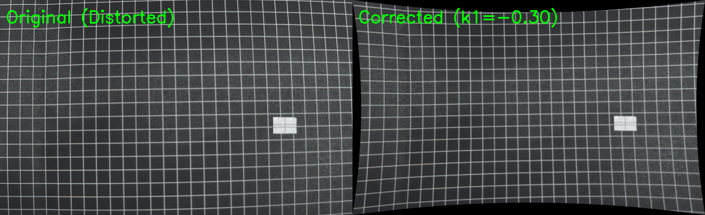

# 相機廣角鏡頭畸變校正 (Camera Lens Distortion Correction)

本模組用於校正廣角相機鏡頭造成的**桶形畸變 (Barrel Distortion)**。

## 問題描述

廣角鏡頭會導致圖像邊緣區域出現扭曲，原本應該是直線的網格會呈現向外彎曲的桶形畸變。這會影響圖像追蹤的精確度。

## 校正方法

使用 OpenCV 的相機校正功能，通過調整徑向畸變係數 (k1, k2) 來校正畸變：
- **k1** (主要徑向畸變係數): 負值用於校正桶形畸變
- **k2** (次要徑向畸變係數): 用於微調邊緣區域

### 最佳參數（已校正）
```
k1 = -0.30
k2 = 0.08
```

## 檔案結構

```
distortion_correction/
├── auto_calibration.py      # 校正腳本
├── camera_calibration.json  # 校正參數檔案
├── final_comparison.png     # 校正前後對比圖
├── img distortion/          # 原始（畸變）圖像
│   └── 1.png ~ 26.png
└── img_corrected/           # 校正後的圖像
    ├── 1.png ~ 26.png
    └── comparison_*.png
```

## 使用方法

### 1. 直接使用校正參數

```python
import cv2
import json
import numpy as np

# 載入校正參數
with open('distortion_correction/camera_calibration.json', 'r') as f:
    calib = json.load(f)

camera_matrix = np.array(calib['camera_matrix'])
dist_coeffs = np.array(calib['dist_coeffs'])

# 校正圖像
image = cv2.imread('your_image.png')
undistorted = cv2.undistort(image, camera_matrix, dist_coeffs)
```

### 2. 使用 auto_calibration 模組

```python
from distortion_correction.auto_calibration import load_calibration, undistort_image

# 載入校正參數
camera_matrix, dist_coeffs = load_calibration('distortion_correction/camera_calibration.json')

# 校正單張圖像
image = cv2.imread('your_image.png')
corrected = undistort_image(image, camera_matrix, dist_coeffs)
```

### 3. 批次處理圖像

```python
from distortion_correction.auto_calibration import apply_calibration

# 使用預設參數校正資料夾中的所有圖像
apply_calibration(k1=-0.30, k2=0.08, 
                  input_folder="your_input_folder",
                  output_folder="your_output_folder")
```

## 校正原理

### 徑向畸變模型

校正使用 OpenCV 的標準徑向畸變模型：

$$
x_{corrected} = x(1 + k_1 r^2 + k_2 r^4 + k_3 r^6)
$$
$$
y_{corrected} = y(1 + k_1 r^2 + k_2 r^4 + k_3 r^6)
$$

其中 $r$ 是像素點到光學中心的距離。

### 參數說明

| 參數 | 值 | 說明 |
|------|-----|------|
| k1 | -0.30 | 主要徑向畸變係數，負值校正桶形畸變 |
| k2 | 0.08 | 次要徑向畸變係數，微調 |
| fx, fy | 561.6 | 焦距（像素） |
| cx, cy | 312.0, 190.5 | 主點位置（圖像中心） |

## 校正效果



- **左側**：原始圖像，網格線向外彎曲（桶形畸變）
- **右側**：校正後，網格線變直

## 校正圖像來源

校正使用 5mm x 5mm 黑底白線網格圖，從不同角度拍攝 26 張照片：
- 網格尺寸：5mm x 5mm
- 參照物：9mm x 6mm 白色設備

## 依賴套件

- OpenCV (`opencv-python`)
- NumPy

## 調整參數

如果校正效果不理想，可以調整 k1 值：
- 線條仍向外彎曲：將 k1 調更負（如 -0.35）
- 線條向內彎曲：將 k1 調更小（如 -0.25）

```python
from distortion_correction.auto_calibration import apply_calibration
apply_calibration(k1=-0.28, k2=0.08)  # 調整後重新校正
```
